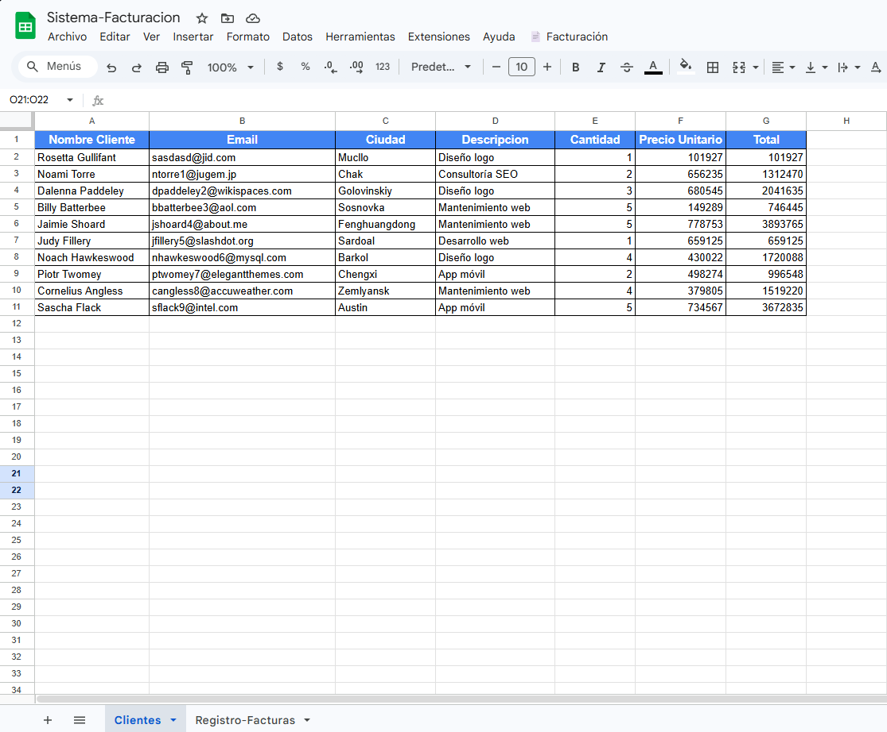
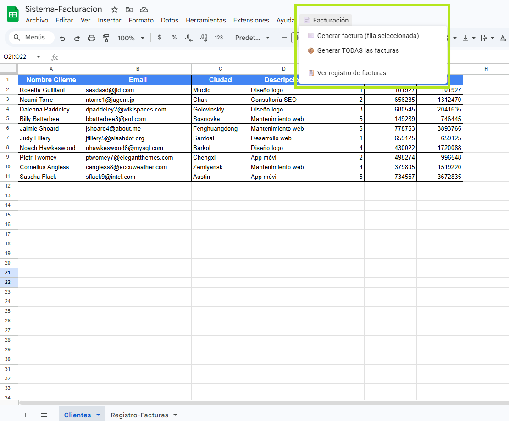
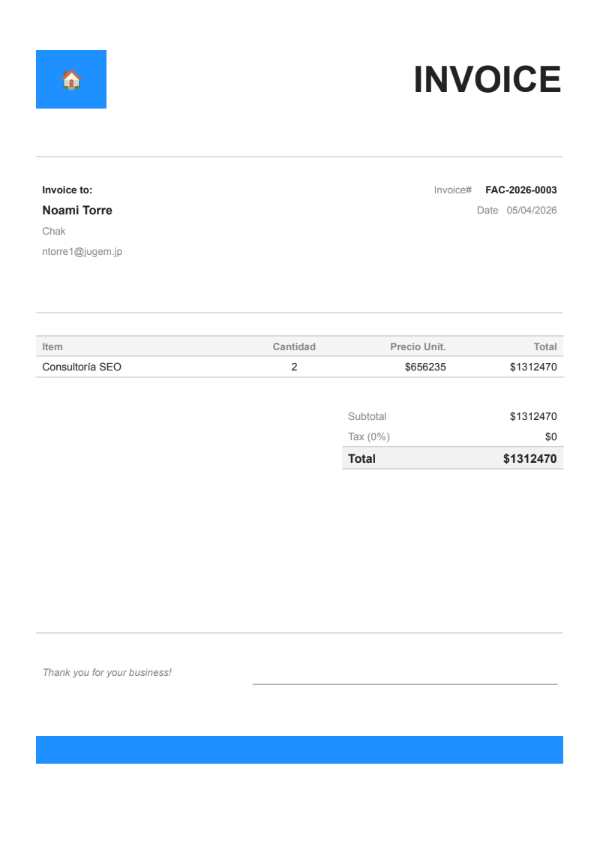
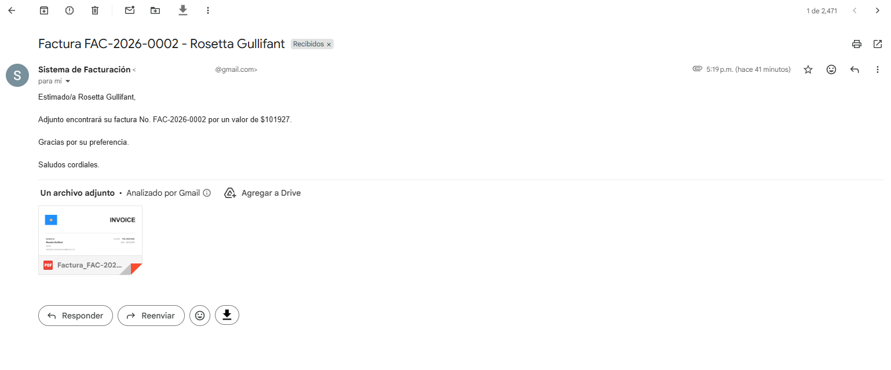
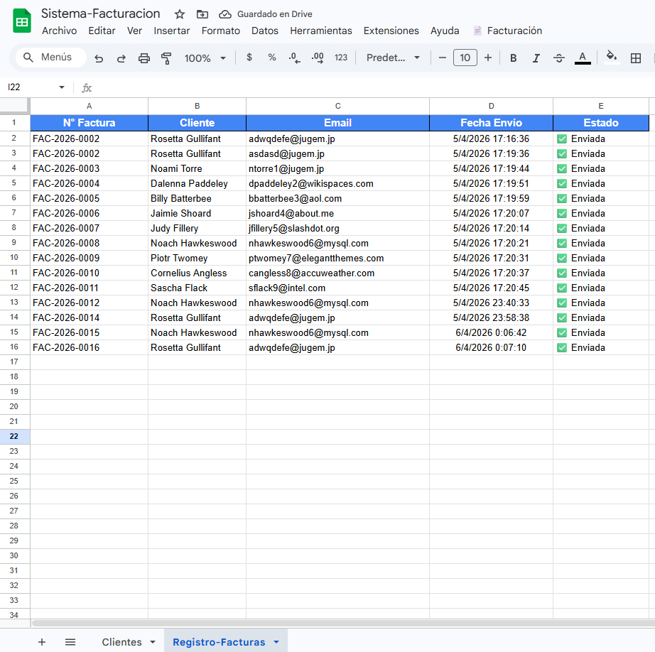

# 📄 Sistema de Facturación Automática — Google Apps Script

Automatización completa de facturación usando Google Workspace.
Genera facturas en PDF personalizadas y las envía por correo
automáticamente con un solo clic desde Google Sheets.

---

## 🚀 ¿Qué hace este proyecto?

- Lee datos de clientes desde Google Sheets
- Genera facturas en PDF desde una plantilla de Google Docs
- Envía las facturas por Gmail con el PDF adjunto
- Registra todos los envíos en un log automático
- Se puede programar para ejecutarse automáticamente cada mes

---

## 🛠️ Tecnologías utilizadas

- Google Apps Script (JavaScript)
- Google Sheets (base de datos de clientes)
- Google Docs (plantilla de factura)
- Gmail API (envío de correos)
- Google Drive API (gestión de archivos PDF)

---

## 📸 Capturas del sistema

### Hoja de Clientes

### Menú Personalizado

### PDF Generado

### Correo Recibido

### Registro de Facturas

---

## ⚙️ Instalación paso a paso

### 1. Preparar Google Drive
Crea esta estructura de carpetas en tu Drive:

📁 Proyecto-Facturacion/
├── 📁 Plantillas/
├── 📁 Facturas-PDF/
└── 📁 Temporal/

### 2. Crear la plantilla
Dentro de `Plantillas/`, crea un Google Doc llamado
`Plantilla-Factura` con los placeholders `{{nombre_cliente}}`,
`{{total}}`, etc. (ver detalle en `config.example.gs`).

### 3. Configurar el script
- Copia `config.example.gs` → renómbralo `config.gs`
- Reemplaza los 3 IDs con los de tus carpetas y plantilla de Drive

### 4. Instalar en Google Sheets
- Abre tu Google Sheets
- Ve a **Extensiones → Apps Script**
- Copia el contenido de `Codigo.gs` y `config.gs`
- Guarda y recarga el Sheets

### 5. Autorizar permisos
- Al recargar el Sheets aparece el menú **📄 Facturación**
- La primera vez pedirá autorizar permisos de Drive, Docs y Gmail

---

## 📋 Uso

| Acción | Cómo hacerlo |
|---|---|
| Factura individual | Selecciona una fila → Menú 📄 Facturación → Generar factura |
| Todas las facturas | Menú 📄 Facturación → Generar TODAS las facturas |
| Ver historial | Menú 📄 Facturación → Ver registro de facturas |

---

## 🤖 Automatización mensual

Para enviar facturas automáticamente el día 1 de cada mes:
1. En Apps Script → ⏰ Activadores
2. Función: `generarTodasLasFacturas`
3. Tipo: Mensual → Día 1 → 8:00 a.m.

---

## 👨‍💻 Autor

**Sebastián Felipe Otalora Guevara**  
Estudiante de Inteligencia Artificial y Cómputo  
[GitHub](https://github.com/SebastiianGuevara)

---

## 📄 Licencia

MIT License
